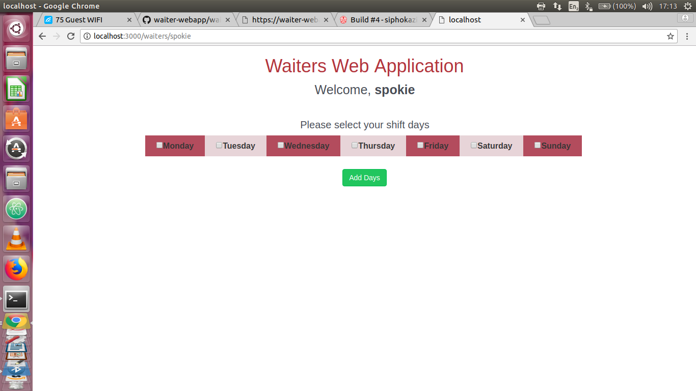
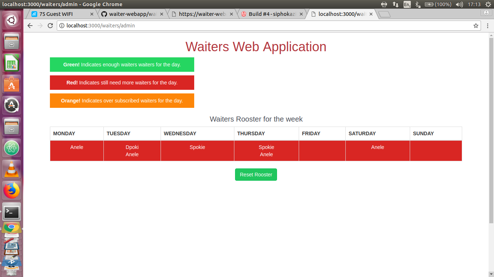

# Waiters Availability WebApp.

## About the Application
The application allows the waiter to enter their name on the as a url parameter than returns the days of the week.  Waiter has the opportunity to select the days they wish to work.  On the other side the admin can enter admin parameter on the url, than the app will return the waiters names and the days they have selected to work.  The admin can also reset the rooster to capture details for a new week.

## Platforms the application can run on
  - Linux (Ubuntu)

## Get the Github Repository
#### Clone the Githhub Repository
  - On your terminal go to the directory where you want the application to be saved
  - On the terminal type: git clone
  https://github.com/siphokazi-codex/waiter-webapp
  Or [you can click the direct link](https://github.com/siphokazi-codex/waiter-webapp).

## Tests
  - Tests for the application 

## Usage
### Output Example
  
  

### How to configure the app and run it on your machine
  - Open the project on your IDE, which is atom
  - Open the  terminal
  - Open the folder where the application is located on the terminal
  - Type nodemon on the terminal
  - Open the browser and type http:/localhost:3000/registration/add [Or you can click the direct link](http://localhost:3000/waiters/WaiterName).
### How the user can use the application
  -On the browser, enter the different waiter name on the parameter WaiterName, you want to select the days the waiter wishes to work.
  http:/localhost:3001/registration/add [Or you can click the direct link](http://localhost:3000/waiters/admin).
### How the user can use the application
  - On the browser, the admin has the opportunity to check which waiters are working on that week once they are done with that week they can reset the rooster for a new week.

## Known Issues
  - The application can only run on Linux Ubuntu platform at the moment, platforms such as macOS, Windows are not yet covered for this application.

## Contributing
  - Create an issue and describe your idea
  - Fork it [https://github.com/siphokazi-codex/waiter-webapp]
  - Create your feature branch (git checkout -b my-new-feature)
  - Commit your changes (git commit -am 'Add some feature')
  - Publish the branch (git push origin my-new-feature)
  - Create a new Pull Request
  - Finish! :white_check_mark:

## License
  - The license for the softwares used in this application is released under the MIT License. [MIT license](https://opensource.org/licenses/MIT)
